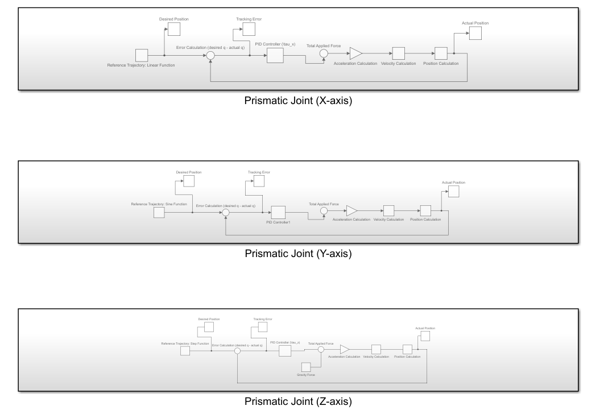
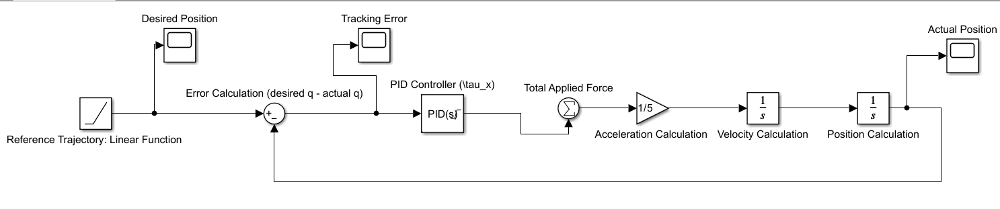
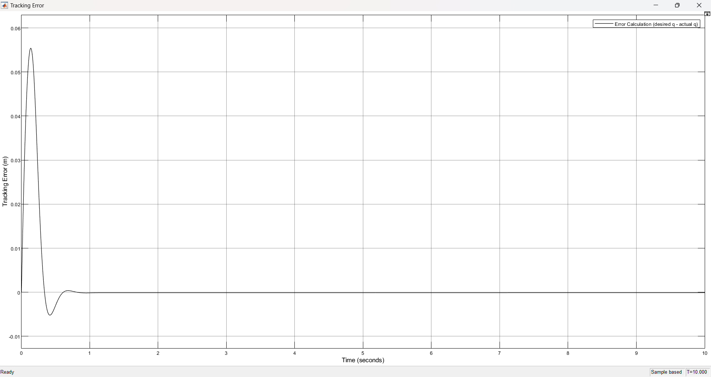
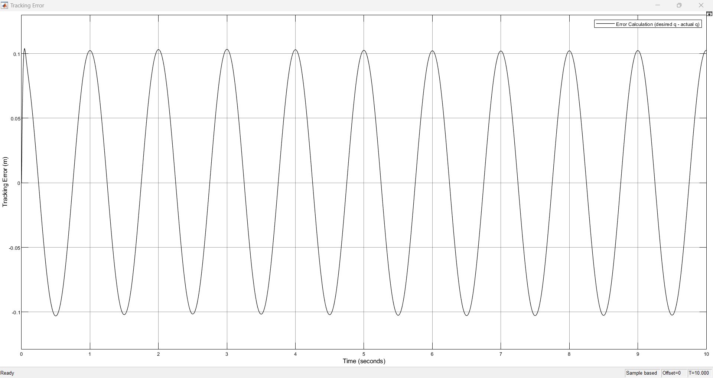
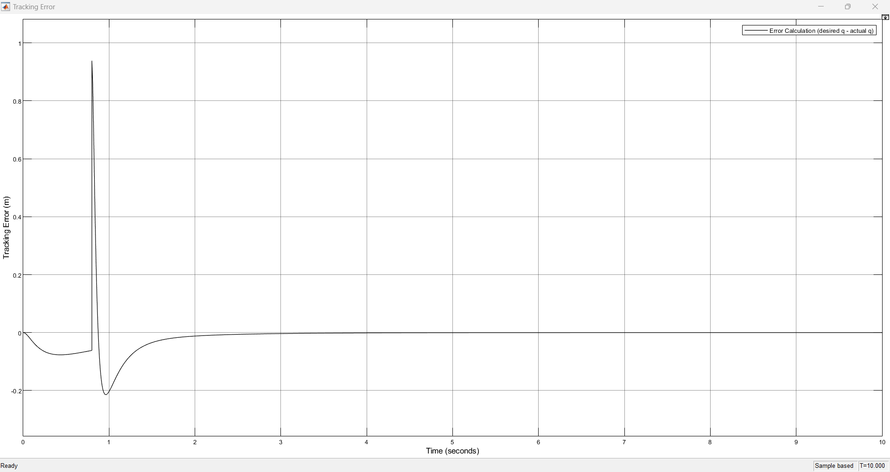
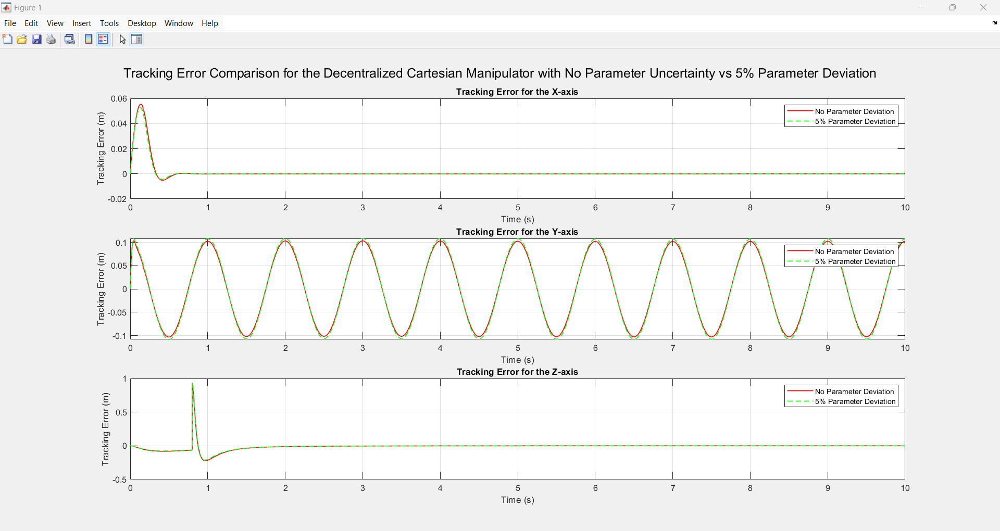

# 🤖 Cartesian Manipulator Control using PID

## 📌 Overview

This project implements a **decentralized control system** for a 3-DOF Cartesian robot manipulator using MATLAB/Simulink.

Each joint is independently controlled using **PID controllers**, enabling accurate trajectory tracking and robust performance under parameter variations.

**This project reflects practical control system design used in robotics and automation systems.**

---

## ⚙️ System Description

The manipulator consists of three prismatic joints operating along:

* X-axis (linear motion)
* Y-axis (sinusoidal motion)
* Z-axis (step motion)

The system dynamics are derived using a **Lagrangian formulation** to obtain the equations of motion for each joint.

---

## 🧠 Control Strategy

A **decentralized PID control architecture** is used:

* Each joint is treated as an independent system
* Control input is computed using tracking error
* Feedback loop ensures stability and accuracy

The controller minimizes the error between:

* Desired trajectory
* Actual joint position

---

## 🧩 Control System Architecture

The control system is implemented in Simulink using a decentralized PID structure.

Each prismatic joint (X, Y, Z) includes:

* Reference trajectory input
* Error calculation (desired − actual)
* PID controller
* Dynamic system (acceleration → velocity → position)
* Feedback loop

---

### 🔹 Example: Single Joint Control Loop

The following diagram shows a zoomed-in view of the control loop for a single prismatic joint.

---

## 📊 Results

### 🔹 Linear Trajectory (X-axis)

### 🔹 Sinusoidal Trajectory (Y-axis)

### 🔹 Step Trajectory (Z-axis)

### 🔹 Robustness Test (5% Parameter Variation)

---

## 📈 Key Observations

* PID controllers successfully reduce tracking error
* System stabilizes quickly after initial transients
* Minor overshoot observed in step response
* Controller remains stable under parameter variation
* Demonstrates strong robustness and reliability

---

## 🧩 Simulink Model

The full control system is implemented in Simulink, where each joint is modelled independently with a PID controller and feedback loop.

The model file is available in the `models/` folder.

---

## ▶️ Tools Used

* MATLAB
* Simulink

---

## 🚧 Future Improvements

* Adaptive or robust control methods
* Model predictive control (MPC)
* Multi-axis coupling effects
* Real-world hardware implementation

---

## 💼 Author

**Jessica Sutherns**
https://github.com/jessysutherns

---

## ⭐ Project Significance

This project demonstrates core robotics engineering concepts including:

* Dynamic modelling of manipulators
* Control system design
* Simulation and performance analysis

It highlights how control strategies enable **precise and stable robotic motion** in real-world applications.
